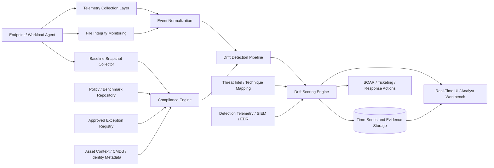

# Beyond Checklists: Turning Compliance Drift into Real-Time Security Signals

**Author:** Mher Saratikyan - Creator of Cactus

## Abstract

Enterprise security programs often assume that controls fail because they were never deployed, never documented, or never reviewed. In practice, many failures occur after deployment, when a system that was once compliant gradually diverges from its intended secure state. This divergence is rarely modeled as an operational problem. It is treated as audit debt, governance debt, or administrative noise. The result is a persistent blind spot: organizations can pass periodic control reviews while production systems drift into exploitable conditions between audits.

This paper argues that compliance drift should be treated as a first-class security signal rather than a periodic governance artifact. The key idea is simple: every deviation between intended secure state and actual runtime state carries information about exposure, control degradation, and attack surface expansion. When that deviation is continuously measured, normalized, and correlated with telemetry, it becomes useful for detection, prioritization, and response.

The paper makes five contributions. First, it provides a formal definition of compliance drift and separates it from static non-compliance. Second, it explains why point-in-time compliance models fail in dynamic environments. Third, it introduces a drift-centric signal model that distinguishes high-risk, silent, and noisy drift. Fourth, it proposes a practical architecture that connects endpoint agents, policy baselines, integrity monitoring, event streams, scoring, and operator workflows. Fifth, it introduces measurable concepts such as drift rate, drift density, time-to-drift-detection, and drift-to-incident correlation, along with a scoring approach suitable for real systems.

The goal is not to replace compliance frameworks. The goal is to operationalize them so that baseline violations, hardening regressions, and exception sprawl become real-time inputs to security decisions.

## Introduction

Security teams are surrounded by checklists. Hardening guides define expected states. Compliance frameworks define required controls. Internal standards describe how systems should be configured. Audit processes periodically validate that these expectations are met. Yet breaches and near-misses continue to emerge from environments that were, at some point, documented as compliant.

The gap is not only a tooling problem. It is a modeling problem.

Most compliance programs are designed to answer static questions: Was a control defined? Was it deployed? Was it reviewed? Was evidence collected? These are governance questions. Attackers exploit a different question: What is true right now on the running system?

That difference matters. A host may have been hardened last quarter, but now allows unsigned PowerShell execution. A firewall may have been reviewed last month, but a temporary rule has remained open in production. A service account may still exist in the inventory, yet its permissions and execution path have drifted from the documented baseline. None of these conditions necessarily appear in an audit artifact at the time they become dangerous. They appear first as runtime divergence.

This problem is more acute now for three reasons.

First, infrastructure changes faster than the control review cycle. Cloud resources, containers, SaaS integrations, endpoint agents, CI/CD systems, and distributed administration have increased the frequency of state change. Second, exceptions accumulate faster than they are retired. Temporary deviations become permanent because operational pressure rewards continuity over restoration. Third, detection engineering and compliance engineering remain organizationally separated. One team reasons about alerts and adversary behavior. Another reasons about benchmarks, evidence, and control attestations. The data rarely meets in a useful operational form.

The industry consequence is predictable. Teams know whether they are broadly aligned to a framework, but do not know when their secure state is degrading in a way that should influence prioritization, triage, or incident response.

This paper addresses that gap. It reframes compliance as a continuous source of telemetry and proposes that drift from hardened baselines be treated as measurable security signal. The thesis is not that every deviation is critical. It is that deviations carry signal value when measured in context: what changed, where, for how long, on which asset, under what exception model, and in correlation with what other events.

## Background

### Traditional compliance models

Traditional compliance models provide normative guidance. NIST, CIS Benchmarks, ISO 27001 control families, and STIG-style baselines encode what secure operation should look like at the policy and configuration level. Their value is substantial. They reduce ambiguity, improve consistency, and make security expectations portable across teams and environments.

However, most implementations of these models are evidence-oriented rather than state-oriented. Compliance is often assessed through snapshots: scanner outputs, attestation forms, exported control statuses, or periodic review tickets. Even when automated scanners are used, the output is frequently consumed as a report rather than as a live stream of operational facts.

This approach works reasonably well for governance assurance. It works poorly for runtime security because it privileges completeness of evidence over timeliness of state.

### Security hardening basics

Hardening is the process of reducing attack surface by disabling unnecessary features, restricting execution paths, limiting privileges, protecting secrets, enforcing configuration constraints, and increasing the cost of abuse. Good hardening baselines are specific. They encode not just generic best practice, but environment-specific expectations for operating systems, workloads, middleware, and control plane components.

Hardening is most effective when it is treated as a maintained state, not a project milestone. The weakness of many hardening programs is not lack of standards. It is lack of continuous validation and operational consequence when the standards degrade.

### Separation of prevention, detection, and compliance

In many organizations, prevention, detection, and compliance are still implemented as independent planes.

- **Prevention** focuses on configuration enforcement, access controls, application policy, and platform restrictions.
- **Detection** focuses on behavioral telemetry, indicators, correlations, anomaly models, and incident workflows.
- **Compliance** focuses on framework mapping, evidence collection, audit readiness, and control attestations.

This separation creates a blind spot. Preventive controls generate state. Detection systems consume events. Compliance tools generate findings. Yet these outputs are rarely normalized into a shared representation of security posture over time. A firewall rule opened outside policy may appear as a change ticket, a scanner finding, or a network event, depending on which team sees it first. Without unification, the organization sees fragments rather than drift.

## Problem Definition

### Defining compliance drift

**Compliance drift** is the time-dependent divergence between an intended secure state and the actual runtime state of an asset, workload, identity, application, or control plane component.

This definition has four important properties.

1. **It is relative to an intended secure state.** Drift cannot be measured without a baseline. The baseline may be derived from a benchmark, internal hardening standard, approved exception model, deployment template, or workload policy.
2. **It is time-dependent.** A deviation that existed for five seconds and was auto-corrected is not operationally equivalent to a deviation that persisted for thirty days.
3. **It is state-based.** The object of analysis is not merely whether a control exists on paper, but whether the live system matches the expected state.
4. **It is contextual.** The same deviation does not carry the same meaning on every asset. Exposure depends on asset criticality, attack path relevance, compensating controls, and threat context.

### Intended secure state vs actual runtime state

The **intended secure state** is the authoritative definition of how a system should operate. It may include:

- expected configuration values
- required services and disallowed services
- filesystem integrity expectations
- access control rules
- cryptographic requirements
- firewall and network segmentation policy
- execution restrictions
- logging and telemetry requirements
- exception scopes, durations, and approvals

The **actual runtime state** is what the system is doing now. It includes observed configuration, live processes, current permissions, open ports, effective rules, package versions, service startup behavior, scheduled tasks, registry values, kernel settings, control plane objects, and related telemetry.

Compliance drift exists when the runtime state departs from the intended secure state in a meaningful way.

### Sources of drift

Drift emerges from several classes of change.

#### Configuration changes

Not all configuration change is malicious or negligent. Normal operations routinely modify state. Hotfixes, troubleshooting, migrations, performance tuning, and temporary workarounds all introduce change. Drift begins when these changes are not reconciled with the baseline or when the baseline is never updated to reflect a deliberately approved new reality.

#### Exceptions

Exceptions are necessary in real environments. They are also a primary source of uncontrolled security degradation. The issue is rarely the existence of an exception. The issue is that exception metadata often lacks enforcement boundaries, expiration, ownership, or runtime visibility. An exception without lifecycle control becomes a silent baseline rewrite.

#### Human factors

Administrators optimize for service continuity. Engineers optimize for deployment velocity. Auditors optimize for evidence. These incentives are reasonable in isolation and dangerous in aggregate. Under time pressure, people create local fixes that become global state. Password vault bypasses, temporary firewall openings, emergency role grants, disabled endpoint protections, and ad hoc service accounts all begin as operational shortcuts.

#### System evolution

Systems evolve faster than many security baselines. New components are added. Legacy components remain. Agent versions diverge. Container images drift from their golden parents. A control that was once sufficient may become irrelevant or incomplete as the environment changes. Drift therefore includes both direct deviation and baseline obsolescence.

### Why audits fail to capture drift

Audits are designed for evidence and assurance, not for runtime continuity. They fail to capture drift for structural reasons.

- They are periodic, while drift is continuous.
- They often sample controls rather than model state transitions.
- They emphasize control presence more than operational effectiveness over time.
- They rarely correlate deviations with attack surface changes or security telemetry.
- They do not usually encode persistence, velocity, or repeated reoccurrence of deviations.

A system can therefore be “compliant” in the reporting sense while simultaneously exhibiting dangerous drift in the operational sense.

## Failure of Current Approaches

### Point-in-time compliance

The dominant model of compliance assessment captures a slice of reality and treats it as representative. This is useful for audits and weak for operations. A monthly scan can confirm that administrative shares were disabled on day thirty. It cannot explain that they were enabled from day two through day twenty-seven, during which time lateral movement telemetry also increased.

Security posture is not a single state. It is a time series. Any control model that ignores the time dimension will understate exposure.

### Fragmented tooling

Organizations often use separate products for configuration assessment, file integrity monitoring, vulnerability management, endpoint detection, cloud posture management, log analysis, and exception tracking. Each tool surfaces part of the story. Few environments maintain a common identity for assets, controls, and deviations across all of them.

This fragmentation causes three practical failures:

1. The same underlying problem appears as multiple uncorrelated findings.
2. High-risk drift is lost among low-priority configuration noise.
3. Detection logic does not benefit from control degradation context.

### Lack of continuous validation

Even when baselines exist, validation is commonly scheduled rather than event-driven. The system learns that a registry key changed at the next scan, not when the change occurred. It detects that logging was disabled after the coverage gap already exists. Continuous validation should not mean heavy full-state scanning every minute. It should mean state-aware monitoring that reacts to meaningful control transitions.

### Weak correlation with real threats

Many compliance findings are presented as abstract control failures with weak operational semantics. This makes them hard to prioritize. A missing configuration is more useful when expressed in adversarial terms:

- what technique does this expose?
- what abuse path does it shorten?
- what telemetry should now be weighted differently?
- has this control historically correlated with incidents on this asset class?

Without threat correlation, compliance output becomes backlog rather than signal.

## Compliance Drift as a Security Signal

### Formalizing the signal concept

A **security signal** is any observable fact that changes the estimated likelihood, severity, or urgency of malicious activity or exploitable weakness. By this definition, drift qualifies as signal when it satisfies three conditions:

1. it is derived from a baseline-to-runtime comparison,
2. it has contextual meaning for exposure or attack feasibility,
3. it can influence operational decisions.

This definition separates drift from generic misconfiguration inventory. A benign mismatch on a low-value lab host may be a record but not a signal. A control regression on a domain controller, identity provider, internet-facing workload, or privileged jump host is both a state deviation and a meaningful signal.

### Detecting drift

Drift detection can be implemented through a combination of techniques:

- event-driven configuration change monitoring
- periodic baseline reconciliation
- file integrity monitoring
- policy evaluation engines
- package and service state verification
- kernel, registry, and control plane object observation
- exception lifecycle validation
- asset role-aware state comparison

No single method is sufficient. Event-driven monitoring provides speed but may miss context if the system was already in a bad state at startup. Periodic reconciliation provides completeness but not immediate awareness. Effective systems use both.

### Quantifying drift

To be operationally useful, drift must be measurable. Useful dimensions include:

- **magnitude**: how far the runtime state deviates from baseline
- **criticality**: how important the affected control is on the affected asset
- **persistence**: how long the deviation has existed
- **spread**: how many assets or identities exhibit the same deviation
- **recurrence**: how often the deviation returns after remediation
- **threat relevance**: how strongly the deviation maps to known abuse paths
- **visibility impact**: whether the deviation weakens telemetry or monitoring coverage

Quantification makes triage possible. It also makes trend analysis possible.

### Prioritizing drift

Not all drift deserves equal attention. Prioritization should consider at least the following:

- asset criticality
- exposure boundary
- control type
- existence and quality of exception
- correlation with recent telemetry
- whether the drift reduces prevention, visibility, or response capacity
- whether the drift is part of a repeated pattern

### Types of drift

#### Critical drift

Critical drift materially increases the likelihood or impact of compromise. Examples include disabled endpoint protection on privileged systems, unexpected firewall exposure on sensitive services, weakened authentication controls, unsigned code execution enablement, or logging suppression on high-value assets.

#### Silent drift

Silent drift is low-visibility degradation that does not immediately raise alarms but meaningfully harms security. Examples include a log forwarding failure, expired hardening exceptions that remain active, reduced script-block logging, weakened local audit policy, or gradual permission expansion on service identities.

Silent drift is dangerous because it often precedes or obscures more obvious malicious activity.

#### Noisy drift

Noisy drift consists of deviations that are technically real but operationally low-value or highly repetitive. Examples include ephemeral configuration states during controlled deployment, short-lived container variance within expected patterns, or benchmark items known to be incompatible with a given workload but not properly exception-scoped.

Noisy drift cannot simply be ignored. It must be modeled so that it does not drown out signal-bearing deviations.

## Proposed Architecture

The proposed model treats compliance telemetry as a streaming security input rather than a report. The architecture below is one practical implementation.



### 1. Endpoint or workload agent

The collection plane must understand system reality at a level richer than log forwarding alone. The agent or collector should gather:

- configuration state relevant to the baseline
- filesystem and registry integrity signals
- service and process metadata
- package and binary metadata
- local policy values
- network exposure state
- control health state
- local exception markers if they exist

The agent does not need to implement all policy logic. Its job is to collect reliable observations and state transitions.

### 2. Telemetry collection layer

Collection should support both event streams and reconciliation snapshots. Event streams provide immediate awareness of meaningful changes. Snapshots establish current truth and allow correction if events are missed. The system should preserve temporal ordering and asset identity so that state transitions can be reconstructed.

### 3. File Integrity Monitoring

File Integrity Monitoring (FIM) is often implemented as a separate compliance feature. In a drift-centric model, FIM is a state transition source. It provides evidence that critical files, policies, modules, or startup artifacts have changed. FIM becomes especially valuable when mapped to control significance. A modified startup script on a privileged Linux server, a changed PowerShell profile, or a tampered EDR configuration file is not only an integrity issue. It is a drift event with likely security meaning.

### 4. Baseline repository and policy engine

Baselines should be machine-readable and versioned. Each baseline item should include:

- control identifier
- expected state expression
- platform scope
- asset role scope
- severity weight
- compensating control hints
- technique or exposure mapping
- validation method
- exception compatibility rules

A policy engine evaluates observed state against this repository. The output should be more expressive than pass or fail. It should include mismatch type, observed value, expected value, confidence, and affected control semantics.

### 5. Approved exception registry

Exceptions must be first-class citizens. If not explicitly modeled, they become unbounded noise. The exception registry should capture:

- scope
- owner
- rationale
- approval chain
- creation time
- expiration time
- permitted drift pattern
- review cadence

The drift engine should treat an expired exception as signal. It should also distinguish between approved deviation and unexplained deviation.

### 6. Drift detection pipeline

This layer joins observed state, baseline expectations, asset context, and exception metadata. Its responsibility is to answer:

- what changed?
- what control does it affect?
- is this expected, approved, or unknown?
- how long has it persisted?
- is this the first occurrence or recurrence?
- what does it imply for exposure or visibility?

The output should be normalized into a consistent drift event schema.

Example schema:

```text
drift_event {
  asset_id
  asset_role
  control_id
  baseline_version
  observed_state
  expected_state
  drift_type
  first_seen
  last_seen
  persistence_seconds
  exception_status
  threat_mapping[]
  visibility_impact
  severity_weight
  confidence
}
```

### 7. Scoring and AI-assisted interpretation

A scoring engine transforms normalized drift events into operational priority. It should combine deterministic weighting with context-aware enrichment. An LLM or other AI component can assist in interpretation, summarization, clustering, and operator guidance, but should not be the source of truth for raw state comparison.

Appropriate AI roles include:

- translating technical control deviations into analyst-readable summaries
- clustering related drift across hosts or control families
- explaining why a deviation matters in terms of exposure
- suggesting remediation order based on blast radius
- correlating drift patterns with historical incident narratives

Inappropriate AI roles include silently inventing policy meaning, replacing deterministic control evaluation, or overriding source telemetry without traceability.

### 8. Storage model

The storage layer should support three simultaneous use cases:

- time-series analysis of control state changes
- evidence retention for audits and remediation workflows
- correlation with security telemetry and incidents

A hybrid storage model is often appropriate: normalized event storage for search and correlation, plus time-series views for trend and persistence analysis.

### 9. Real-time UI

The operator interface should not resemble a compliance spreadsheet. It should expose:

- drift trends over time
- high-risk control regressions
- asset-focused posture degradation
- exception debt
- visibility-reducing drift
- correlation with detections and incidents
- remediation state and ownership

The UI should allow analysts to pivot from a detection to the control state of the affected asset, and from a drift event to the related telemetry and ownership context.

### 10. Response integration

Response should be selective. Some drift should open tickets. Some should trigger containment. Some should update detection weighting. Examples:

- disabling endpoint telemetry on a critical server may increase alert sensitivity for related host activity
- an unexpected firewall exposure may trigger temporary segmentation validation
- a weakened authentication control may trigger priority review of recent access events
- repeated drift recurrence after remediation may escalate to engineering governance or infrastructure owner review

## Metrics and Measurement

A drift-centric program needs metrics that are operational, not merely presentational.

### Core metrics

| Metric | Definition | Why it matters |
|---|---|---|
| Drift rate | Number of new drift events per asset or control family per unit time | Indicates posture volatility |
| Drift density | Number of active drift conditions per host, workload, or identity | Shows concentration of degradation |
| Time-to-drift-detection (TTDD) | Elapsed time between actual state change and system detection | Measures monitoring effectiveness |
| Time-to-drift-remediation (TTDR) | Elapsed time from detection to confirmed restoration or approved exception | Measures operational response |
| Drift persistence | Duration a drift condition remains active | Distinguishes transient variance from real exposure |
| Drift recurrence | Count of reappearance after remediation within a defined window | Reveals fragile fixes or chronic operational issues |
| Exception debt | Active exceptions weighted by age, criticality, and expiration status | Measures tolerated risk accumulation |
| Drift-to-incident correlation | Statistical or empirical linkage between drift conditions and subsequent incidents | Tests whether drift signals real risk |

### Scoring model

A practical drift risk score can be defined as:

```text

Score = W_c \times C + W_a \times A + W_p \times P + W_t \times T + W_v \times V + W_e \times E + W_r \times R

```

Where:

- \(C\) = control criticality
- \(A\) = asset criticality
- \(P\) = persistence factor
- \(T\) = threat relevance factor
- \(V\) = visibility impact factor
- \(E\) = exception penalty or offset
- \(R\) = recurrence factor

The exact weights should be environment-specific. The model matters more than the formula. The goal is to avoid a flat severity label and instead reflect how dangerous a drift condition is in context.

### Pseudo-algorithm for scoring

```text
function score_drift(event):
    control = control_weight(event.control_id)
    asset = asset_weight(event.asset_role, event.asset_criticality)
    persistence = persistence_weight(event.persistence_seconds)
    threat = technique_weight(event.threat_mapping)
    visibility = visibility_weight(event.visibility_impact)
    recurrence = recurrence_weight(event.recurrence_count)

    if event.exception_status == "approved_active":
        exception_modifier = approved_exception_offset(event)
    elif event.exception_status == "expired" or event.exception_status == "unknown":
        exception_modifier = exception_penalty(event)
    else:
        exception_modifier = 0

    base = control + asset + persistence + threat + visibility + recurrence
    return normalize(base + exception_modifier, 0, 100)
```

### Interpreting the metrics

Metrics should not be treated as vanity indicators. A low drift count may simply indicate poor visibility. A high drift rate during a migration may be normal if exceptions and ownership are well-modeled. Trend interpretation requires change context, asset lifecycle awareness, and data quality monitoring.

## Practical Scenarios

### Scenario 1: Credential exposure through misconfiguration

An enterprise Windows administration tier requires PowerShell constrained language mode, script block logging, and restrictions on local administrative access. During an urgent troubleshooting session, an administrator disables one of the execution constraints and suppresses a logging setting. The intention is temporary. The system continues in this state for nine days.

In a traditional compliance model, the issue appears at the next benchmark scan or periodic review. In a drift-centric system, three signals appear immediately:

1. a runtime deviation from the hardened baseline,
2. a visibility reduction because command execution logging is degraded,
3. increased threat relevance because the affected host is privileged and the control regression maps to credential theft and post-exploitation abuse.

If, during that same window, the system also observes unusual LSASS access attempts or suspicious module loads, the drift signal raises the significance of those events. The point is not that the misconfiguration proves compromise. The point is that it changes the operational meaning of nearby telemetry.

### Scenario 2: Firewall rule drift leading to exposure

A sensitive internal service is intended to be reachable only from a narrow management segment. A temporary firewall rule is added for vendor troubleshooting and never removed. The change ticket closes; the exposure remains.

In static compliance, this becomes a stale network finding. In a drift-centric system, the condition is modeled as an unauthorized exposure boundary change with persistence. The scoring engine increases priority because:

- the affected asset is high value,
- the drift expands inbound reachability,
- the exception has expired,
- the condition persists beyond the maintenance window.

If external scanning, internal reconnaissance, or failed authentication bursts later occur against that service, those events are interpreted within a changed control context. Analysts no longer see isolated noise. They see a path opening.

### Scenario 3: Endpoint hardening drift enabling persistence

A Linux server baseline requires strict permissions on cron directories, auditing of startup persistence paths, and integrity monitoring on key service files. A configuration management error weakens directory permissions and exempts a startup file from monitoring due to a packaging mismatch.

This does not immediately produce an incident. It produces silent drift. The risk compounds because the affected controls are specifically relevant to persistence and tampering. If an adversary later writes a launcher into an inadequately protected path, the environment has already lost both prevention quality and visibility coverage. The earlier drift event becomes an early signal that was ignored.

These scenarios illustrate the core thesis: drift is often the earliest measurable sign that a secure state is decaying into an exploitable state.

## Integration with AI and Modern Systems

AI can materially improve operator efficiency in drift-centric programs, but only if it is used with restraint and strong boundaries.

### Useful roles for AI and LLMs

#### Interpretation

Security telemetry is rich and difficult to read at scale. AI can convert raw drift facts into concise explanations that preserve technical meaning. For example, it can summarize that a host lost script logging, has an expired exception, and now requires increased attention for execution-related events.

#### Correlation

Drift events often need clustering across assets, business units, or control families. AI can help identify patterns such as repeated exception abuse, recurring control regressions after specific deployment workflows, or common root causes across hosts.

#### Prioritization assistance

AI can assist in ranking remediation candidates by synthesizing asset context, exposure semantics, and recent detection data. This is helpful when the deterministic score alone does not explain order of operations clearly to humans.

#### Investigation support

When analysts pivot from an incident to posture context, AI can produce case summaries, suggested follow-up checks, and explanations of how specific drift conditions may have affected exploitability or visibility.

### Boundaries and safeguards

The core posture engine must remain deterministic and auditable. AI should not decide whether a control passed. It should operate on already-normalized facts. Every AI output used in operations should be attributable to source state and traceable to the underlying control events.

A good design principle is: **AI interprets; policy engines decide.**

## Discussion

### False positives and semantic mismatch

Not every baseline deviation is meaningful. Some drift is expected and harmless. The main technical challenge is semantic mismatch between generic benchmarks and workload-specific reality. This is why exception handling, asset role modeling, and environment-specific baselines are essential. A drift program without those features will produce noise and lose operator trust.

### Scaling challenges

Continuous state comparison across large fleets introduces cost. The system must avoid full re-evaluation of everything at all times. Efficient architectures combine event-triggered evaluation with scheduled reconciliation, cache policy lookups, and scope checks by asset role. Compression of repeated unchanged state is also important for storage efficiency.

### Data quality and identity resolution

A drift signal is only as useful as its mapping to real assets and ownership. Weak asset identity, inconsistent naming, or missing role metadata will degrade prioritization. The same is true for exceptions that are poorly recorded or unstructured.

### Organizational barriers

A drift-centric operating model challenges existing boundaries. Compliance teams may view it as too operational. Detection teams may view it as extra noise. Platform teams may resist the implication that every temporary change becomes observable debt. Success therefore depends on governance that treats secure state as a shared operational responsibility rather than a separate reporting function.

## Future Work

Three directions are especially promising.

### Autonomous remediation with safety constraints

Some drift conditions are safe to auto-remediate. Others require staged approval or can interrupt service. Future systems should distinguish self-healing candidates from high-blast-radius cases and attach reversible remediation logic with strong guardrails.

### Predictive drift modeling

Drift is often patterned. Specific teams, deployment pipelines, maintenance windows, or asset classes may produce recurring deviations. Predictive modeling could identify where drift is likely to emerge next and recommend preventative controls before degradation occurs.

### Integration with attack simulation

Attack simulation and adversary emulation can validate whether measured drift meaningfully affects exploitability. This closes the loop between compliance state and empirical attack feasibility. A mature system should be able to ask not only whether a control drifted, but whether that drift materially shortened a real attack path.

## Conclusion

Security programs fail when they confuse documented control intent with maintained secure state. Compliance, as commonly practiced, is too static to capture how quickly systems diverge under operational pressure. Hardening, if not continuously verified, decays silently. Detection, if not informed by control state, misses context. Audit evidence, if not connected to runtime reality, provides false assurance.

Compliance drift offers a more operational model. It describes the gap between how a system is supposed to behave and how it actually behaves over time. That gap is measurable. It can be collected as telemetry, scored as risk, correlated with threat activity, and used to drive response. When treated this way, compliance stops being a separate reporting function and becomes part of the security sensing layer.

The practical implication is straightforward. Do not ask only whether a control exists. Ask whether the live system is still in the secure state the control was meant to enforce, how long it has not been, what that change means for exposure, and what nearby telemetry should now be interpreted differently.

That is the shift beyond checklists: from proving that controls were once present to continuously detecting when security state begins to fail.
